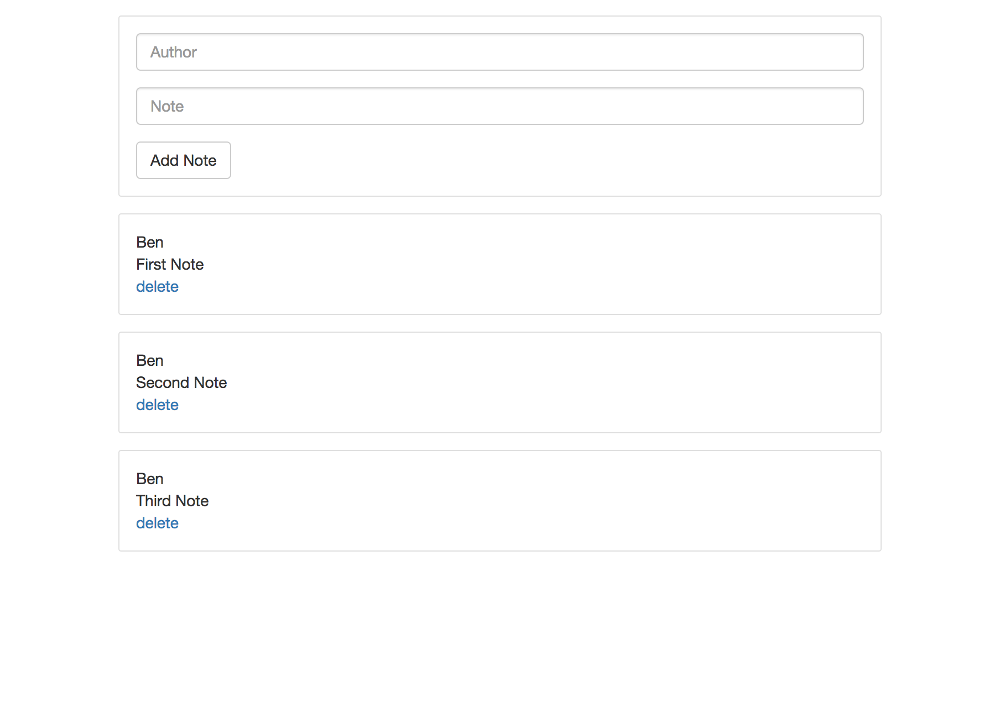

## A working demo for a SPA with Vue.js and gRPC courtesy of gRPC-web.



## installation

Install the latest version of Google protobuf for your system at: https://github.com/google/protobuf/releases

Then clone, build and run the project:

```bash
git clone https://github.com/b3ntly/vue-grpc.git
cd vue-grpc
yarn install
./scripts/get_go_deps
npm run start
```

The project will be running on localhost:8080.

# Notes

* The latest version of gRPC-web changed a method signature (see recent commit) so please ensure
you have the latest version present on your gopath in order to get this project
to run

* My shell script for installing protobuf appears to have broken, so I've removed it up to you to get the right version for your system

* Fixed breaking Webpack build bug